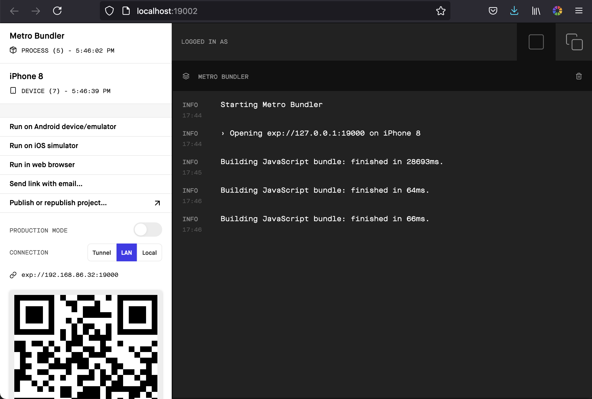

# react-native-material-starter
Starter React Native project with Material UI

## Getting Started

Make sure to check out how to set up your dev environment [here](https://reactnative.dev/docs/next/environment-setup).

After cloning, go to the root of the project and

    yarn install

then

    yarn start

You should then see a browser open to your dev instance.

Click on the appropriate link to run the simulator. Make sure you have set up emulators (more info [here](https://reactnative.dev/docs/next/environment-setup)).
